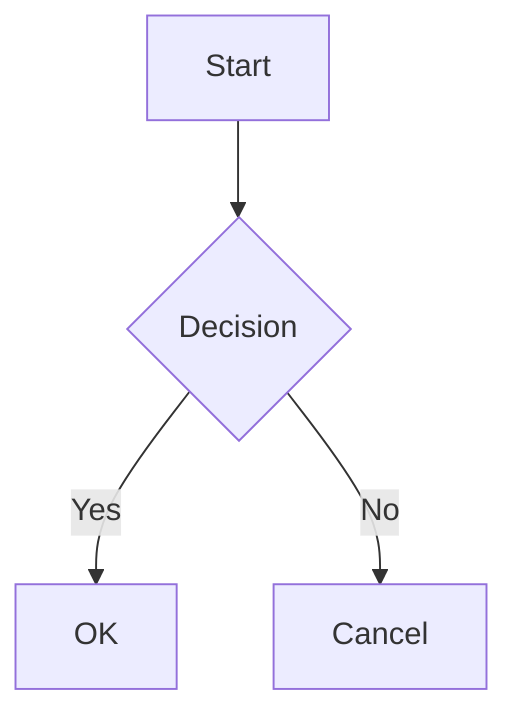

# Documentation Editor with GIF Maker

A modern documentation editor built with PyQt6 that combines Markdown editing with Mermaid diagram support and animated GIF creation capabilities.

## Features

### Markdown Editor
- Real-time preview of Markdown content
- Support for Mermaid diagrams
- Split-view interface with resizable panes
- Theme support (Light/Dark/System)
- Syntax highlighting for code blocks
- Table support
- File management (New, Open, Save, Save As)

### GIF Maker
- Convert PNG sequences to animated GIFs
- Customizable background colors
- Adjustable frame delay
- Drag-and-drop frame reordering
- Preview functionality
- Automatic image normalization
- Maintains aspect ratios

## Installation

1. Clone the repository:
```bash
git clone https://github.com/yourusername/documentation-editor.git
cd documentation-editor
```

2. Install dependencies:
```bash
pip install -r requirements.txt
```

## Usage

### Running the Application
```bash
python main.py
```

### Markdown Editor

The editor supports standard Markdown syntax plus Mermaid diagrams. To create a Mermaid diagram, use the following syntax:

````markdown

````

### Creating Animated GIFs

1. Open the GIF Maker from the Tools menu
2. Click "Add PNG Files" to select your image sequence
3. Arrange frames using Move Up/Down buttons
4. Set the frame delay (in milliseconds)
5. Choose a background color
6. Click "Convert to GIF" to create your animation

## Dependencies

- PyQt6
- Pillow (PIL)
- Markdown
- Mermaid.js (included via CDN)

## Configuration

The application saves your preferences (including theme selection) between sessions. Configuration files are stored in:
- Windows: `%APPDATA%/DocumentationEditor/`
- Linux: `~/.config/DocumentationEditor/`
- macOS: `~/Library/Application Support/DocumentationEditor/`

## Contributing

1. Fork the repository
2. Create your feature branch (`git checkout -b feature/AmazingFeature`)
3. Commit your changes (`git commit -m 'Add some AmazingFeature'`)
4. Push to the branch (`git push origin feature/AmazingFeature`)
5. Open a Pull Request

## License

This project is licensed under the MIT License - see the LICENSE file for details.

## Acknowledgments

- Mermaid.js for diagram rendering
- PyQt6 for the application framework
- Python Markdown for Markdown processing
