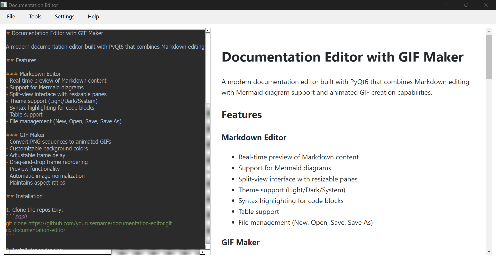
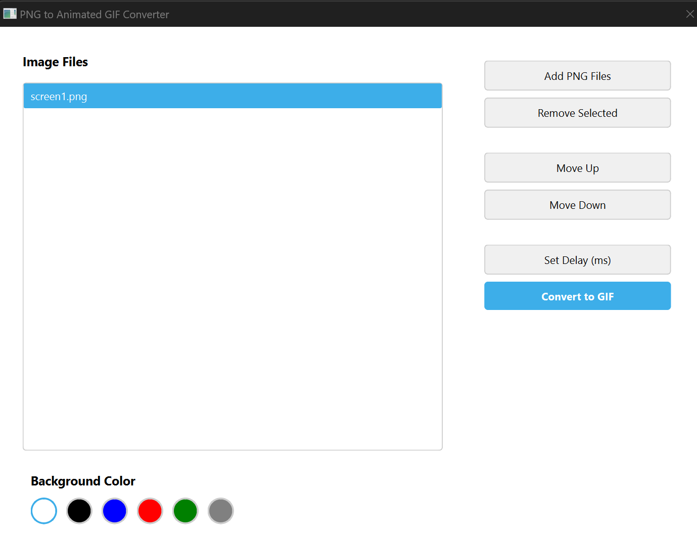
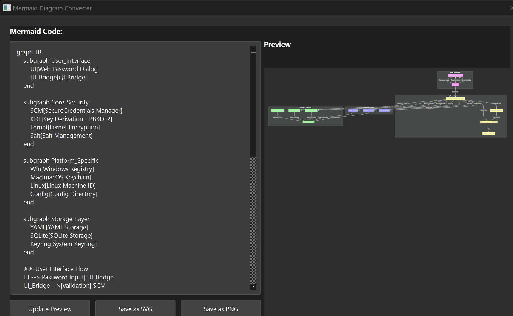
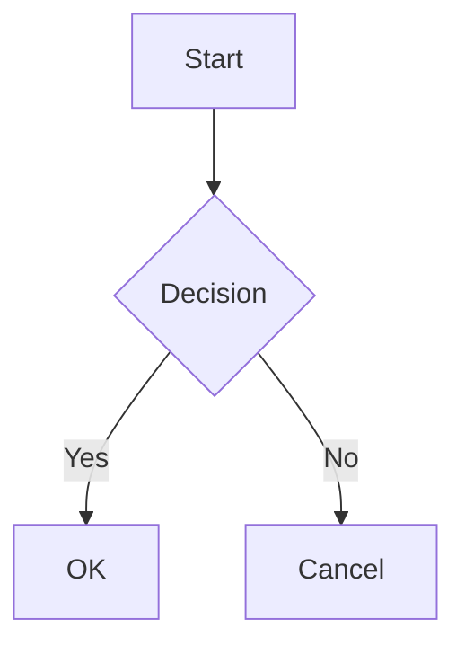

# PyMerDoc - Mermaid Documentation Tools

A modern documentation toolkit built with PyQt6 that combines Mermaid diagram support with animated GIF creation capabilities. Perfect for creating technical documentation, tutorials, and animated diagrams.


## Screenshots

### Main Documentation Interface

Create and edit documentation with live Mermaid diagram previews.

### GIF Builder Tool

Convert image sequences to animated GIFs for documentation.

### Mermaid Converter

Convert Mermaid syntax to various diagram formats.

## Features

### Main Application (pymerdoc)
- Real-time preview of Mermaid diagrams
- Export diagrams to PNG/SVG
- Modern cyberpunk-themed interface
- Theme support (Light/Dark/System)
- File management capabilities

### GIF Maker (pymerdoc-gm)
- Convert PNG sequences to animated GIFs
- Customizable background colors
- Adjustable frame delay
- Drag-and-drop frame reordering
- Preview functionality

### Mermaid Converter (pymerdoc-mc)
- Standalone Mermaid diagram converter
- Multiple export formats
- Batch processing capabilities
- Custom styling options

## Installation

### From PyPI (Recommended)
```bash
pip install pymerdoc
```

### From Source
```bash
git clone https://github.com/scottpeterman/pymerdoc.git
cd pymerdoc
pip install -e .
```

## Usage

### Running the Applications

1. Main Documentation Tool:
```bash
pymerdoc
# or
python -m pymerdoc.main
```

2. GIF Builder:
```bash
pymerdoc-gm
# or
python -m pymerdoc.gm
```

3. Mermaid Converter:
```bash
pymerdoc-mc
# or
python -m pymerdoc.mc
```

### Creating Mermaid Diagrams

1. Open the main application
2. Enter your Mermaid syntax:

3. Preview updates in real-time
4. Export to desired format

### Creating Animated GIFs

1. Launch the GIF Builder:
```bash
pymerdoc-gm
```
2. Add PNG files using the "Add Files" button
3. Adjust frame order and timing
4. Set background color if needed
5. Click "Generate GIF" to create animation

## Requirements

- Python 3.8+
- PyQt6 6.8.0+
- PyQt6-WebEngine 6.8.0+
- Pillow 11.0.0+
- Additional dependencies listed in requirements.txt

## Configuration

The application stores configuration in platform-specific locations:
- Windows: `%APPDATA%/pymerdoc/`
- Linux: `~/.config/pymerdoc/`
- macOS: `~/Library/Application Support/pymerdoc/`

## Development Setup

1. Create virtual environment:
```bash
python -m venv .venv
source .venv/bin/activate  # Linux/macOS
.venv\Scripts\activate     # Windows
```

2. Install development dependencies:
```bash
pip install -r requirements.txt
```

3. Run tests:
```bash
pytest tests/
```

## Project Structure
```
pymerdoc/
├── docs/                 # Documentation and screenshots
├── pymerdoc/            # Main package
│   ├── main.py          # Main application
│   ├── gm.py            # GIF maker
│   ├── mc.py            # Mermaid converter
│   └── theme_manager.py # Theme handling
└── tests/               # Test suite
```

## Contributing

1. Fork the repository
2. Create your feature branch
```bash
git checkout -b feature/AmazingFeature
```
3. Commit your changes
```bash
git commit -m 'Add some AmazingFeature'
```
4. Push to the branch
```bash
git push origin feature/AmazingFeature
```
5. Open a Pull Request

## Testing

Run the test suite:
```bash
pytest tests/
```

## License

This project is licensed under the GNU General Public License v3 (GPLv3) - see the [LICENSE](LICENSE) file for details.

## Contact

Project Link: [https://github.com/scottpeterman/pymerdoc](https://github.com/scottpeterman/pymerdoc)

## Acknowledgments

- Mermaid.js for diagram rendering
- PyQt6 for the application framework
- All our contributors and users

## Release Notes

### 0.1.0
- Initial release
- Basic Mermaid diagram support
- GIF creation tool
- Mermaid converter utility